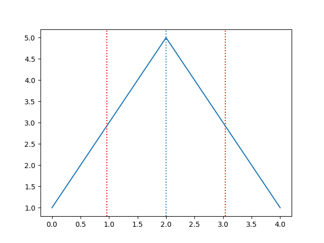

# Basics
Here are some basics knowledge about mathematics.

> Each formulas URLs are generated using the website https://www.codecogs.com/latex/eqneditor.php  
## Mean


```python
import numpy as np
np.mean(X)
```

## Median
Let's **values**, a collection of discrete value.
If **n**, the number of values, is odd:

![values[\frac{(n+1)}{2}]](https://latex.codecogs.com/gif.latex?values%5B%5Cfrac%7B%28n&plus;1%29%7D%7B2%7D%5D)  

Else, if **n**, the number of values, is even:

![\frac{values[\frac{n}{2}] + values[\frac{n}{2} + 1]}{2}](https://latex.codecogs.com/gif.latex?%5Cfrac%7Bvalues%5B%5Cfrac%7Bn%7D%7B2%7D%5D%20&plus;%20values%5B%5Cfrac%7Bn%7D%7B2%7D%20&plus;%201%5D%7D%7B2%7D)

```python
import numpy as np
np.median(X)
```

## Variance
The variance measures how far each number in the set is from the mean. Variance is calculated by taking the differences between each number in the set and the mean, squaring the differences (to make them positive) and dividing the sum of the squares by the number of values in the set.


```python
# X is a numpy array
X.var()
```

## Standard deviation

In statistics, the standard deviation (SD, also represented by the Greek letter sigma σ or the Latin letter s) is a measure that is used to quantify the amount of variation or dispersion of a set of data values.


```python
# X is a numpy array
import math

standard_deviation = math.sqrt(X.var())
# or 
standard_deviation = X.std()
```

#### Plotting the standard deviation
```python
import numpy as np
import matplotlib.pyplot as plt
X = np.array([1, 2, 3, 4, 5, 6, 7])
Y = np.array([2, 3, 5, 9, 5, 3, 2])
plt.plot(X, Y)
plt.axvline(x=X.mean(), linestyle='dotted')
plt.axvline(x=X.mean()-X.std(), linestyle='dotted',color='r')
plt.axvline(x=X.mean()+X.std(), linestyle='dotted',color='r')
plt.show()
```


## Covariance
In probability theory and in statistics, the covariance between two random variables is a number allowing to quantify their joint differences with respect to their respective expectations. It is also used for two sets of numerical data (deviations from averages). 


```python
import numpy as np
# Let X and Y, two series of variables 
X = np.array([1,2,3])
Y = np.array([6,8,12])

# calculate the covariance
covariance = np.cov(X,Y, bias=True)[0][1]
```

The calculation need some explanations. 

First, we can see that we use the **bias** parameter. That's because, by default, _numpy.cov_ function use a normalization by (N-1) where N is the number of estimations given. \
Setting the _bias_ parameter to **True** or **1** tell the function to use a normalization by N.

Also, we also keep the element _[0][1]_. The result returned by the _numpy.cov_ function is a (2,2) matrix as follow: 

  

## Pearson correlation coefficient

In statistics, the Pearson correlation coefficient, also referred to as Pearson's r, the Pearson product-moment correlation coefficient (PPMCC) or the bivariate correlation, is a measure of the linear correlation between two variables X and Y.


```python
p_corrcoef = np.corrcoef(X, Y)
```
The result is a _Pearson product-moment correlation coefficient_. But what does that mean ?
That can be described as follow:

 

Where 

and
 
must always be approximately equal to 1. From a mathematical point of view, that's always equal to 1 but, because of floating point and precision, the result given by python can be less than 1 (0,9999999 for example).

